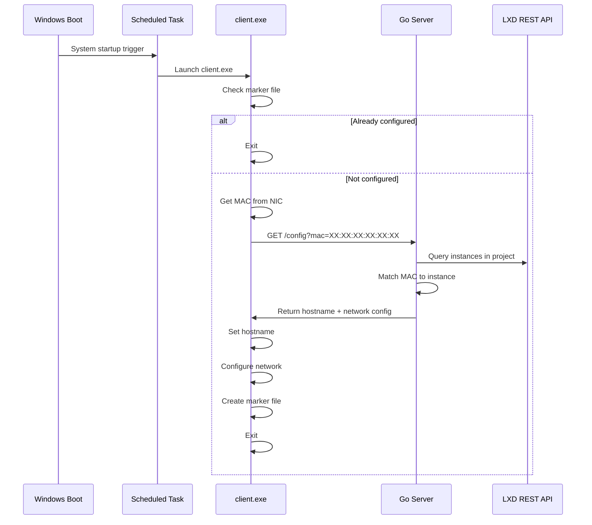

# LXD Windows Configuration Agent

## Architecture Overview



## Project Structure

```
Cyber_Range/
├── go.mod
├── cmd/
│   ├── server/
│   │   └── main.go           # Server entry point (Linux)
│   └── client/
│       └── main.go           # Client entry point (Windows)
├── internal/
│   ├── config/
│   │   └── types.go          # Shared types
│   ├── server/
│   │   ├── server.go         # HTTP server
│   │   └── lxd.go            # LXD API client
│   └── client/
│       ├── mac.go            # Read MAC address
│       ├── hostname.go       # Set hostname via Windows API
│       ├── network.go        # Configure IP via netsh
│       └── marker.go         # Run-once marker logic
└── scripts/
    └── setup-task.ps1        # PowerShell to create Scheduled Task
```

## Components

### 1. Server (Linux - OpenTofu Box)

**Endpoint**: `GET /config?mac={mac_address}`

- Connects to LXD REST API using client certificates
- Queries all instances in the configured project
- Finds instance whose NIC matches the requested MAC
- Parses `cloud-init.network-config` (handles "DHCP" or netplan YAML)
- Returns JSON with hostname and network settings

**Config file** (`config.yaml`):
```yaml
listen: ":8080"
lxd:
  url: "https://lxd-server:8443"
  cert: "/path/to/client.crt"
  key: "/path/to/client.key"
  project: "homelab-dcig"
```

### 2. Client (Windows VM)

**Location**: `C:\ProgramData\cyber-range\client.exe`

- Runs at system startup via Scheduled Task (before user login)
- Checks marker at `C:\ProgramData\cyber-range\.configured`
- Reads MAC address from primary network adapter
- Requests config from server (URL passed via `-server` flag or config)
- Sets hostname using `SetComputerNameExW` Windows API
- Configures network via `netsh` commands:
  - DHCP: `netsh interface ip set address "Ethernet" dhcp`
  - Static: `netsh interface ip set address "Ethernet" static {ip} {mask} {gw}`
- Creates marker file on success
- Logs to `C:\ProgramData\cyber-range\config.log`

### 3. Scheduled Task Setup

PowerShell script to create the task (run once when preparing base image):

```powershell
$action = New-ScheduledTaskAction -Execute "C:\ProgramData\cyber-range\client.exe" `
    -Argument "-server http://OPENTOFU_IP:8080"
$trigger = New-ScheduledTaskTrigger -AtStartup
$principal = New-ScheduledTaskPrincipal -UserId "SYSTEM" -RunLevel Highest
Register-ScheduledTask -TaskName "CyberRangeConfig" -Action $action `
    -Trigger $trigger -Principal $principal
```

## Terraform Prerequisite

Update `main.tf` to add network config for Windows VMs:

```hcl
resource "lxd_instance" "lan_windows" {
  # ... existing ...
  config = {
    "security.secureboot" = "false"
    "cloud-init.network-config" = "DHCP"
  }
}
```

## Build Commands

```bash
# Server (Linux)
GOOS=linux GOARCH=amd64 go build -o server ./cmd/server

# Client (Windows)
GOOS=windows GOARCH=amd64 go build -o client.exe ./cmd/client
```

## Image Preparation

Bake into `windows-10-base` image:
1. Copy `client.exe` to `C:\ProgramData\cyber-range\`
2. Run `setup-task.ps1` to create the Scheduled Task
3. Snapshot/export the image

## Implementation Tasks

- [ ] Initialize Go module with go.mod
- [ ] Create shared types in internal/config/types.go
- [ ] Implement LXD API client to query instances and match by MAC
- [ ] Implement HTTP server with /config endpoint
- [ ] Create server entry point with config file support
- [ ] Implement Windows MAC address reader
- [ ] Implement hostname change via SetComputerNameExW
- [ ] Implement network config via netsh commands
- [ ] Implement run-once marker file logic
- [ ] Create Windows client entry point
- [ ] Create PowerShell script for Scheduled Task setup


